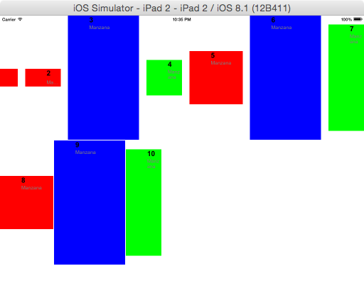
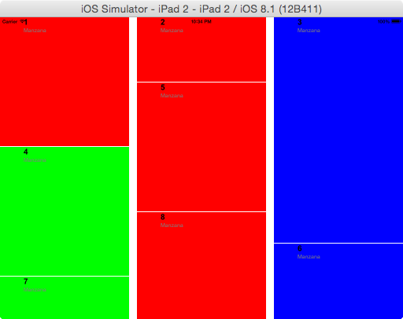

#TiCollectionView

## Overview

This module allows you to use a collection / grid view with the Appcelerator Titanium SDK.

It uses the Titanium `ItemTemplate` objects for the best performance.

### Grid layout

### Waterfall layout

## Installation
### Get it 
Download the latest distribution ZIP-file and consult the [Titanium Documentation](http://docs.appcelerator.com/titanium/latest/#!/guide/Using_a_Module) on how install it, or simply use the [gitTio CLI](http://gitt.io/cli):

`$ gittio install de.marcelpociot.collectionview`

### Important notes for Android
In order to make this module work for Android, you need to use the provided "CollectionView.js" CommonJS library.

## API

This module uses the [Ti.UI.ListView API](http://docs.appcelerator.com/titanium/3.0/#!/api/Titanium.UI.ListView).

## Additional parameters

The ListView API gets extended by these custom parameters:

* `layout` _(LAYOUT_WATERFALL | LAYOUT_GRID)_ - sets the layout to use for the collection view. You can select between the waterfall layout (like Pinterest) or the standard grid layout which is the default value.

### Waterfall layout specific configuration

* `columnCount` _(Number)_ The number of columns to use. Default: 3
* `minimumColumnSpacing` _(Number)_ The minimum spacing between each columns
* `minimumInteritemSpacing` _(Number)_ The minimum spacing between each items (vertically)
* `renderDirection` _(DIRECTION_LEFT_TO_RIGHT | DIRECTION_RIGHT_TO_LEFT | DIRECTION_SHORTEST_FIRST)_ The render direction to use. Default: DIRECTION_LEFT_TO_RIGHT

### Android specific configuration

* `columnWidth` _(Number)_ - Defines the width of each column. The Android module will fit as many columns in a row as possible
* `verticalSpacing` _(Number)_ - Defines the vertical column spacing
* `horizontalSpacing` _(Number)_ - Defines the horizontal column spacing

## Usage

Alloy:

        <ListView id="listView" backgroundColor="white" defaultItemTemplate="template" module="CollectionView" method="createCollectionView">

        <Templates>
            <ItemTemplate name="template">
                <View id="container">
                    <Label bindId="info" id="title" />
                    <Label bindId="es_info" id="subtitle" />
                </View>
            </ItemTemplate>

        </Templates>

        <ListSection module="de.marcelpociot.collectionview" method="createCollectionSection">

            <ListItem module="de.marcelpociot.collectionview" method="createCollectionItem" width="150" height="200" info:text="Apple" es_info:text="Manzana" />
            <ListItem module="de.marcelpociot.collectionview" method="createCollectionItem" width="150" height="200" info:text="Banana" es_info:text="Banana" />
            <ListItem module="de.marcelpociot.collectionview" method="createCollectionItem" width="150" height="200" info:text="Apple" es_info:text="Manzana" />
            <ListItem module="de.marcelpociot.collectionview" method="createCollectionItem" width="150" height="200" info:text="Banana" es_info:text="Banana" />
        </ListSection>
    </ListView>
Vanilla JS:

	var collectionView = require("de.marcelpociot.collectionview");

	var win = Ti.UI.createWindow({backgroundColor: 'white'});

	// Create a custom template that displays an image on the left, 
	// then a title next to it with a subtitle below it.
	var myTemplate = {
    	childTemplates: [
        	{                            // Title 
            	type: 'Ti.UI.Label',     // Use a label for the title 
    	        bindId: 'info',          // Maps to a custom info property of the item data
	            properties: {            // Sets the label properties
        	        color: 'black',
            	    font: { fontFamily:'Arial', fontSize: '20dp', fontWeight:'bold' },
                	left: '60dp', top: 0,
            	}
	        },
    	    {                            // Subtitle
        	    type: 'Ti.UI.Label',     // Use a label for the subtitle
            	bindId: 'es_info',       // Maps to a custom es_info property of the item data
	            properties: {            // Sets the label properties
    	            color: 'gray',
        	        font: { fontFamily:'Arial', fontSize: '14dp' },
            	    left: '60dp', top: '25dp',
	            }
    	    }
	    ]
	};

	var listView = require("CollectionView")".createCollectionView({
		backgroundColor: "white",
		top: 0,
		left: 0,
		width: Ti.UI.FILL,
		height: Ti.UI.FILL,
	    // Maps myTemplate dictionary to 'template' string
	    templates: { 'template': myTemplate },
	    // Use 'template', that is, the myTemplate dict created earlier
	    // for all items as long as the template property is not defined for an item.
	    defaultItemTemplate: 'template',
	    // ANDROID ONLY
	    columnWidth: 150,
	    verticalSpacing: 10,
	    horizontalSpacing: 10
	});
	var sections = [];

	var fruitSection = collectionView.createCollectionSection({ headerTitle: 'Fruits / Frutas'});
	var fruitDataSet = [
    	// the text property of info maps to the text property of the title label
	    // the text property of es_info maps to text property of the subtitle label
	    // the image property of pic maps to the image property of the image view
	    { info: {text: 'Apple'}, es_info: {text: 'Manzana'}, properties: {height:150,width:150}},
	    { info: {text: 'Apple'}, es_info: {text: 'Manzana'}, properties: {height:150,width:150}},
	];
	fruitSection.setItems(fruitDataSet);
	sections.push(fruitSection);

	listView.setSections(sections);
	win.add(listView);
	win.open();
	
## Changelog
* v1.2.0
	* Added waterfall layout for iOS
* v1.0.0  
  * Initial release with Android support added
